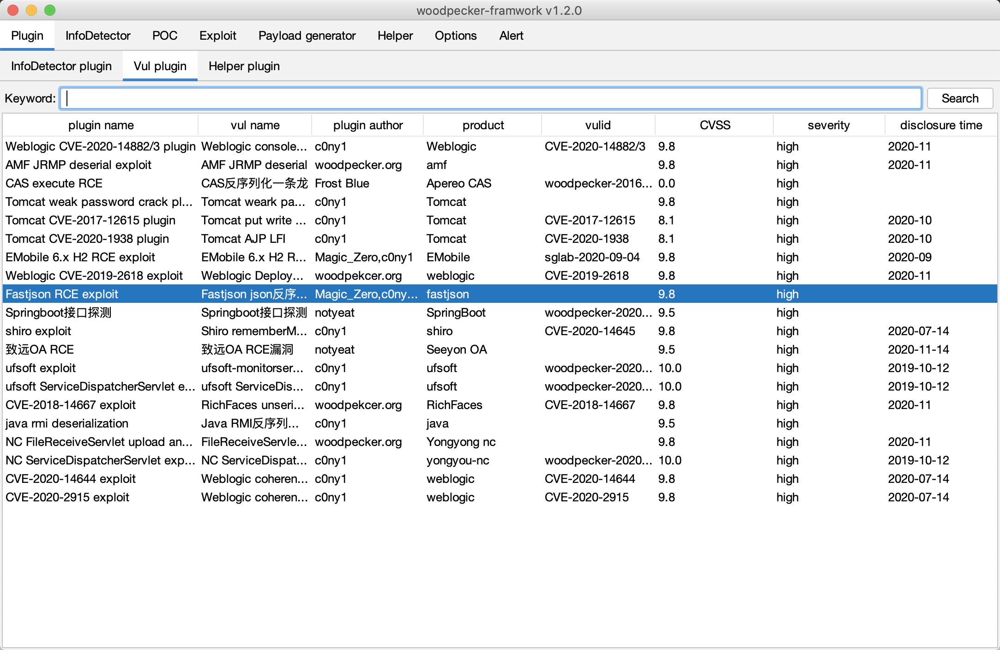

  
  
Vulnerability accurate detection and deep exploit framework

  
  
  

## 0x01 简介
woodpecker-framework是一款漏洞精准检测深度利用框架，只做一件事：`精准狙击高危漏洞`。

针对人群：专业打点人士。

* 目标探测
* 精准检测
* 深度利用
* 荷载生成

## 0x02 更多
* [woodpecker-framework官网](http://woodpecker.gv7.me/)
* [插件仓库](https://github.com/woodpecker-appstore)
* [插件编写指南](https://github.com/woodpecker-appstore/plugin-example)